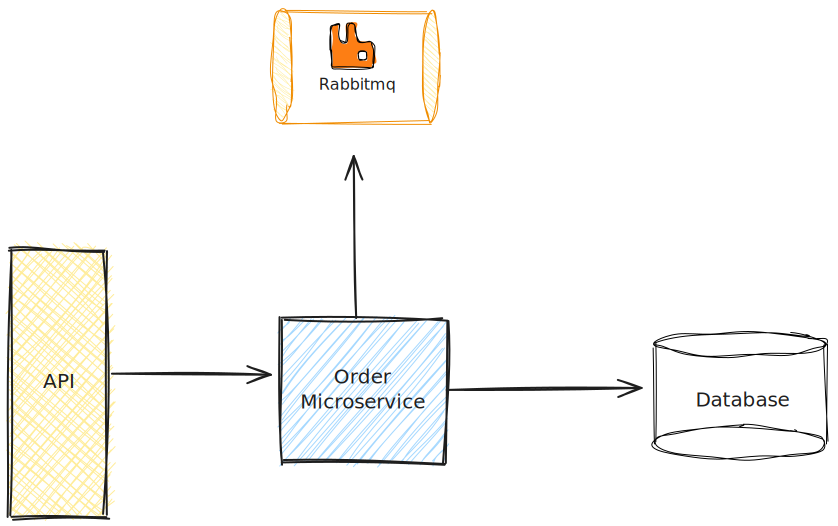

# challenge-beta (versão meu inglês)



### Requirements
- Must be the Docker and Docker Compose installed in your machine

### Running Application
- docker-compose build
- docker-compose up -d

Now you can see the golang api running on port 8080, the rabbitmq management running on port 15672 and postgres 5432.

All apps are exposing ports because it is a test enviroment.

### Volumes
- Postgres and Rabbitmq container are both has a persistent volume. That stays in root app folder in the path.
    - ./volumes/rabbitmq/data
    - ./volumes/postgres/data

### Application
- The app endpoints are:
    - **Route with POST method** "/pedidos" that generates a new order and store in the postgres database with status "PENDENTE" and publish this order in a rabbitmq queue.
    - **Route with GET method** "/pedidos/:pedidoId" that list just one order with the same id were passed in the path
    - **Route with GET method** "/pedidos" that list all orders

---------------------------------------------------------

# challenge-beta (versão inglês do gepeto)

### Requirements
- Docker and Docker Compose must be installed on your machine.

### Running the Application
1. Build the containers:
   ```sh
   docker-compose build
   ```
2. Start the containers:
   ```sh
   docker-compose up -d
   ```

Now, you can see the Go API running on port 8080, the RabbitMQ management interface on port 15672, and PostgreSQL on port 5432.

All services are exposing ports since this is a test environment.

### Volumes
- Both the PostgreSQL and RabbitMQ containers have persistent volumes, located in the root app folder:
    - `./volumes/rabbitmq/data`
    - `./volumes/postgres/data`

### Application Endpoints
- The app endpoints are:
    - `POST /pedidos`: Generates a new order, stores it in the PostgreSQL database with status "PENDENTE", and publishes this order to a RabbitMQ queue.
    - `GET /pedidos/:pedidoId`: Lists a single order with the ID specified in the path.
    - `GET /pedidos`: Lists all orders.